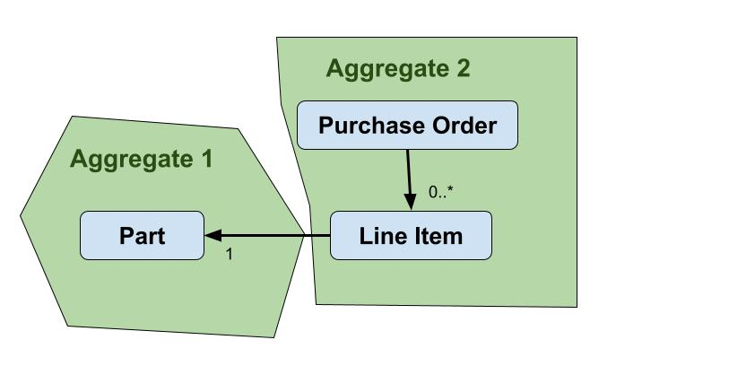

This project shows the end-to-end development of an application (both web and console) using the Domain Driven Design approach.

## Model

Our simple application revolves around creating `Purchase Orders` for `Parts`, and adding/removing purchase order `Line Items` to and from a `Purchase Order`. The line item contains the part (e.g. notebook) and the quantity ordered (e.g. 2). Below is the OOP model for the model showing references. 

We use the term `Aggregate` from DDD to organize the Purchase Order and Purchase Order Line items into a single cohesive group. 

Additionally, we have a business rule for determining if the purchase order is under the approval limit.

## Architecture

The architecture is still yet to be fleshed out.

The idea is to have three layers
- **Application:** This is where the code will go for the web application or console application. Depends only on the Domain Layer (`po.app` package)
- **Domain:** Contains the model components, services, and the repository (which is the interface to the infrastructure layer) (`po.domain` package)
- **Infrastructure:** The persistence layer (`po.infrastructure`)

